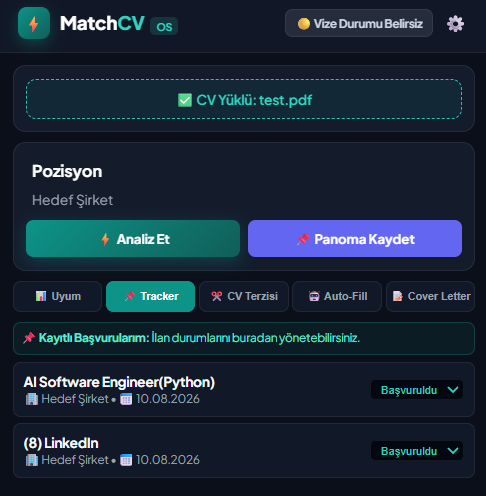
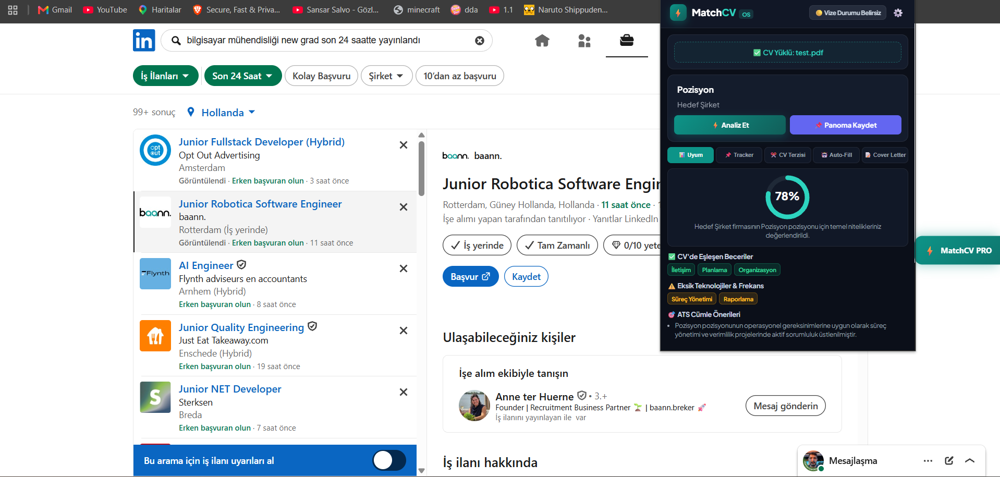
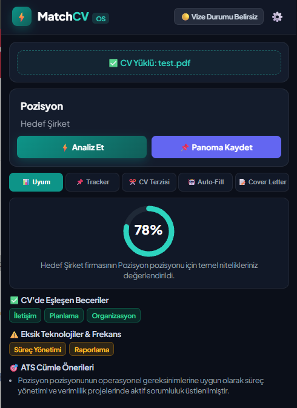

# ⚡ MatchCV Enterprise OS — Omnichannel AI Career Assistant & ATS Engine

MatchCV is a high-performance, Manifest V3 Chrome Extension and FastAPI-backed micro-SaaS platform that bridges the gap between job seekers and Applicant Tracking Systems (ATS). Powered by Google Gemini 1.5 Flash, it parses job postings dynamically from 40+ career platforms in real-time and provides semantic match scoring, actionable resume bullet suggestions, salary benchmarking, and automated form auto-filling.

<!-- Product Preview / Demo Banner -->
<p align="center">
  
</p>

---

## 🚀 Key Features

* **Universal Scraping Engine (Omnichannel):** Dynamic SPA DOM parsing supporting LinkedIn, Indeed, Glassdoor, Greenhouse, Lever, Workday, and 40+ job platforms.
* **Semantic Resume Matcher:** Leverages LLM embeddings via Gemini API to extract hard & soft skills, providing real-time percentage match scoring (e.g., **78% Match**), and missing skill gaps (e.g., **Süreç Yönetimi**, **Raporlama**).
* **AI Summary Generator:** Generates high-impact, 3-4 sentence professional summary paragraphs tailored specifically to the viewed position.
* **ATS Bullet Suggestion Engine:** Delivers single-click copyable action bullets to optimize candidate CVs for hard ATS filters.
* **Real-time Market Salary Benchmark:** Analyzes role levels and location context to offer salary range estimates.
* **Micro-SaaS Ready Architecture:** Built-in quota tracking (10 free monthly analyses), LemonSqueezy subscription webhook handling, and PRO paywall UI.
* **Native Side Panel UX:** High-speed Drawer UI with tabbed navigation (Analysis, Application Tracker, and PDF Manager) built using vanilla ES6 JavaScript to prevent memory leaks and main-thread blocking.

---

## 📸 Product Walkthrough

| 1. Live Job Scraping & Side Panel | 2. Semantic Analysis & ATS Match |
| :---: | :---: |
|  |  |

---

## 🛠️ Architecture & Tech Stack

### Frontend / Chrome Extension (Manifest V3)
* **Language:** Vanilla ES6+ JavaScript, CSS3 (Scoped Isolated DOM)
* **API Ingestion:** Fetch API with dynamic payload transformation
* **UX/UI:** Asynchronous Toast Notifications, Animated SVG Score Meters, Drawer Panels

### Backend / Microservice
* **Framework:** FastAPI (Python 3.10+)
* **AI Model:** Google Gemini 1.5 Flash (`google-generativeai`)
* **Storage:** SQLite3 (WAL mode for concurrent connection isolation)
* **Server:** Uvicorn ASGI

---

## 📂 Project Structure

```bash
matchcv-project/
├── matchcv-backend/
│   ├── app.py               # FastAPI core, Gemini API Integration, SQLite Quota System
│   ├── requirements.txt     # Python production dependencies
│   └── matchcv.db           # SQLite Database (Auto-initialized)
│
├── matchcv-extension/
│   ├── manifest.json        # Manifest V3 Extension Config & Permissions
│   ├── content_script.js    # Universal Scraping Engine & Side Panel Drawer UI
│   ├── popup.html           # Secondary Extension Popup View
│   └── icons/               # Production assets
│
├── demo-preview.png         # Main repository banner

* 🚀 Quick Start
1. Backend Setup
Bash
cd matchcv-backend
pip install -r requirements.txt
# Set your GEMINI_API_KEY in environment or .env
uvicorn app:app --reload --port 8000
2. Chrome Extension Installation
Open Google Chrome and navigate to chrome://extensions/.

Enable Developer mode (top right toggle).

Click Load unpacked and select the matchcv-extension/ directory.

Navigate to any supported job platform (e.g., LinkedIn, Indeed) to use the extension.

👤 Author
Serkan Kaya

LinkedIn: linkedin.com/in/your-profile

GitHub: @your-username
├── screenshot-sidepanel.png  # Side panel UI screenshot
├── screenshot-results.png   # Analysis score screenshot
└── README.md                # Project Documentation
